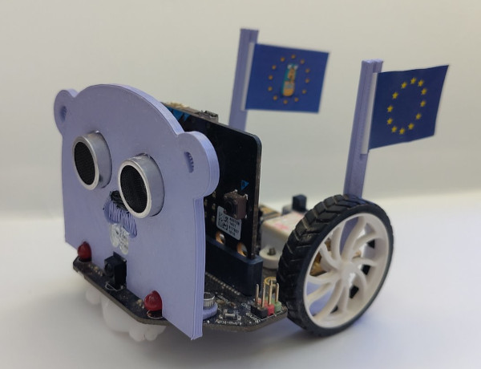

# Gopherino

Gopherino es un robot basado en la [plataforma Maqueen v4.1](https://wiki.dfrobot.com/micro_Maqueen_for_micro_bit_SKU_ROB0148-EN#target_6) y controlador por un [BBC Microbit (v1 o v2)](https://wiki.dfrobot.com/micro_Maqueen_for_micro_bit_SKU_ROB0148-EN#target_6). Tiene diversos sensores incluidos, LEDs RGB y dos motores para echar a rodar. Así como varios puertos de expansión distribuidos por todo el cuerpo.

## Sensores y pines
- Sensores en escala de grises infrarrojos (para el sigue-lineas) en los pines P13 y P14
- 4x LEDs RGB (WSS2812) en el pin P15
- 2x LEDs rojos en los pines P8 y P12
- Sensor infrarrojos en el pin P16
- Zumbador en el pin P0
- Sensor ultrasónico HC-SR04 (conectado) en los pines P1 y P2
- Motores conectados por I²C

## Ideas
El actual código de Gopherino es bastante simple. Usa el sensor de ultrasonidos HC-SR04 para detectar un obstáculo y cambiar el rumbo. Así que no hay límite en las posibilidades de expandir su funcionamiento. Aquí hay algunas ideas:

- Usa los sensores infrarrojos de escala de grises para hacer que siga una linea
- Haz que emita sonidos por el zumbador (quizás cuando encuentre un obstáculo)
- Alegra el ambiente con sus LEDs RGB
- Acepta comandos por el sensor infrarrojos (P16), necesitarás un emisor de IR como un mando de la tele o un flipper zero
- Hazte fotos con el ¡es super mono!

## License

Public domain. Feel free to use however you wish. Attribution is appreciated though.
