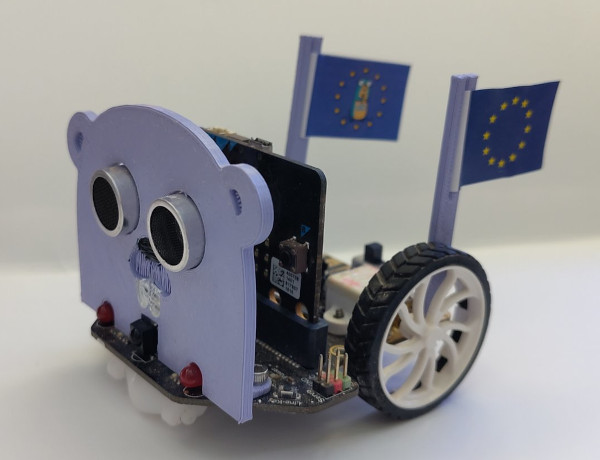

# Gopherino

Gopherino es un robot basado en la [plataforma Maqueen v4.1](https://wiki.dfrobot.com/micro_Maqueen_for_micro_bit_SKU_ROB0148-EN#target_6) y controlador por un [BBC Microbit (v1 o v2)](https://wiki.dfrobot.com/micro_Maqueen_for_micro_bit_SKU_ROB0148-EN#target_6). Tiene diversos sensores incluidos, LEDs RGB y dos motores para echar a rodar. Así como varios puertos de expansión distribuidos por todo el cuerpo.



## Sensores y pines
- Sensores en escala de grises infrarrojos (para el sigue-lineas) en los pines P13 y P14
- 4x LEDs RGB (WSS2812) en el pin P15
- 2x LEDs rojos en los pines P8 y P12
- Sensor infrarrojos en el pin P16
- Zumbador en el pin P0
- Sensor ultrasónico HC-SR04 (conectado) en los pines P1 y P2
- Motores conectados por I²C


## Firmware BLE (mando nicectrlr)

[`ble/main`](ble/main/) convierte a Gopherino en un robot Bluetooth que se controla con el mando de dos joysticks [nicectrlr](https://code.madriguera.me/GoEducation/nicectrlr) usando su ejemplo [`gopherino-remote`](https://code.madriguera.me/GoEducation/nicectrlr/src/branch/main/examples/gopherino-remote). Pulsa X en el mando para cambiar de modo:

| Modo | Controles | LEDs |
|------|-----------|------|
| Normal | El joystick izquierdo mueve las dos ruedas. A: pitido, Y: claxon, B: destello, L/R: LED rojo izquierdo/derecho | Azul |
| Tanque | Joystick izquierdo = rueda izquierda, joystick derecho = rueda derecha. Mismos botones que en Normal | Verde |
| Música | Y/B/A/L/R tocan Do/Re/Mi/Sol/La en el zumbador mientras se mantienen pulsados. Joystick izquierdo: octava, joystick derecho: desafinar | Arcoíris |
| Auto | Gopherino conduce solo y esquiva obstáculos con el HC-SR04 | Rojo fijo en marcha, rojo parpadeando ante un obstáculo |

El robot envía al mando la distancia que mide el HC-SR04, y se para si deja de recibir órdenes durante medio segundo o si se desconecta. El protocolo está descrito en [`ble/main/protocol.go`](ble/main/protocol.go). El mando antiguo para Badger 2040 W de `ble/gamepad` usa el protocolo anterior y no funciona con este firmware.

```sh
tinygo flash -target microbit-v2-s113v7 ./ble/main
```

## Ideas
El actual código de Gopherino es bastante simple. Usa el sensor de ultrasonidos HC-SR04 para detectar un obstáculo y cambiar el rumbo. Así que no hay límite en las posibilidades de expandir su funcionamiento. Aquí hay algunas ideas:

- Usa los sensores infrarrojos de escala de grises para hacer que siga una linea
- Haz que emita sonidos por el zumbador (quizás cuando encuentre un obstáculo)
- Alegra el ambiente con sus LEDs RGB
- Acepta comandos por el sensor infrarrojos (P16), necesitarás un emisor de IR como un mando de la tele o un flipper zero
- Hazte fotos con el ¡es super mono!


## License

Public domain. Feel free to use however you wish. Attribution is appreciated though.
